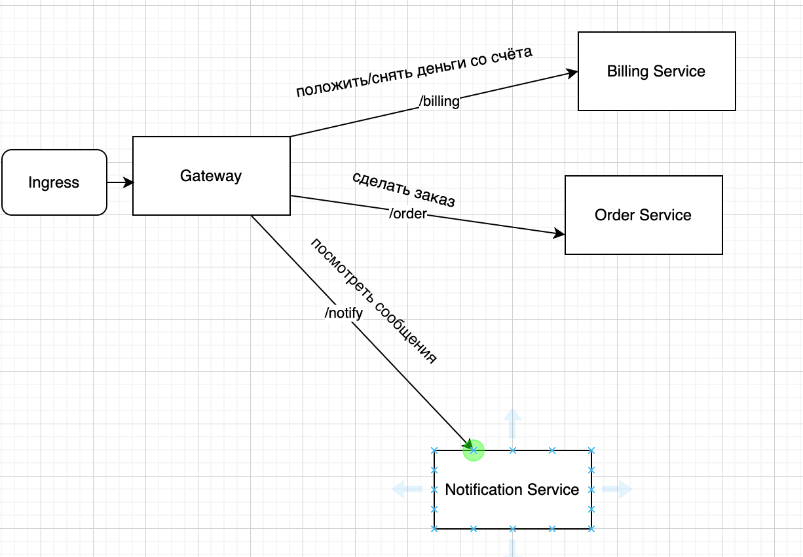

# Пример реализации микросервисного приложения

### Общая схема архитектурного решения:

Приложение состоит из сервисов Order, Billing и Notification, 
а также Spring Cloud Gateway API для роутинга запросов на эти сервисы.
Межсервисное взаимодействие осуществляется через брокер сообщений (kafka).
Пользователь взаимодействует с сервисами через вызов REST-сервисов

Описание сценариев использования:
- Создать пользователя (аккаунт в биллинге).
- Положить деньги на счет пользователя в сервисе биллинга.
- Сделать заказ, на который хватает денег в сервисе заказов.
- Посмотреть деньги на счету пользователя в сервисе биллинга и убедиться, что их сняли.
- Посмотреть в сервисе нотификаций отправленные сообщения и убедиться, что сообщение отправилось
- Сделать заказ, на который не хватает денег в сервисе заказов.
- Посмотреть деньги на счету пользователя и убедиться, что их количество не поменялось.
- Посмотреть в сервисе нотификаций отправленные сообщения и убедиться, что сообщение отправилось. 

